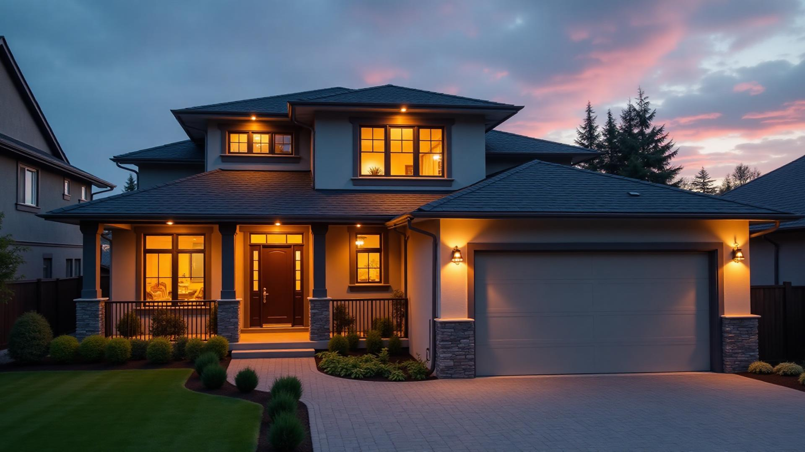

# Ascent Group Construction - Official Website



## 🏗️ About This Project

This is the official website for **Ascent Group Construction**, a Mississauga-based construction company specializing in residential painting and Stucco/EIFS services across the Greater Toronto Area (GTA).

**Live URL**: [Your Production URL Here]

## 🚀 Quick Start

### Prerequisites

- Node.js 18+ and npm installed ([install with nvm](https://github.com/nvm-sh/nvm#installing-and-updating))

### Local Development

```bash
# 1. Clone the repository
git clone <YOUR_GIT_URL>

# 2. Navigate to project directory
cd ascent-group-construction

# 3. Install dependencies
npm install

# 4. Start development server
npm run dev
```

The site will be available at `http://localhost:8080`

## 📁 Project Structure

```
ascent-group-construction/
├── public/               # Static assets
│   ├── robots.txt       # SEO crawler instructions
│   └── sitemap.xml      # Site structure for search engines
├── src/
│   ├── assets/          # Images and media files
│   ├── components/      # Reusable React components
│   │   ├── ui/         # shadcn-ui components
│   │   ├── home/       # Homepage sections
│   │   └── estimator/  # Estimator form steps
│   ├── lib/            # Utility functions and validations
│   ├── pages/          # Page components (routes)
│   ├── utils/          # Helper functions
│   ├── data/           # CMS content and configurations
│   ├── index.css       # Global styles and design system
│   └── App.tsx         # Main app and routing
├── supabase/
│   └── functions/      # Backend edge functions
└── tailwind.config.ts  # Tailwind CSS configuration
```

## 🎨 Tech Stack

- **Framework**: React 18 + TypeScript
- **Build Tool**: Vite
- **Styling**: Tailwind CSS + Custom Design System
- **UI Components**: shadcn-ui
- **Routing**: React Router v6
- **Forms**: React Hook Form + Zod validation
- **Backend**: Lovable Cloud (Supabase)
- **Deployment**: Lovable.dev (or Vercel/Netlify)

## 🛠️ Features

### ✅ Implemented

- **Responsive Design**: Optimized for mobile, tablet, and desktop
- **Accessibility**: WCAG 2.1 AA compliant with semantic HTML
- **SEO Optimized**: Meta tags, structured data, sitemap
- **Interactive Estimator**: Multi-step quote request with real-time calculations
- **Contact Forms**: Secure form handling with rate limiting
- **Modern Animations**: Smooth parallax effects and transitions
- **Dark Mode Ready**: Design system supports theme switching
- **Performance**: Lazy loading, code splitting, optimized images
- **Security**: Input validation, rate limiting, secure backend integration

### 📋 Page Routes

| Route | Description |
|-------|-------------|
| `/` | Homepage with hero, services, stats, testimonials |
| `/about` | Company history, mission, values, team |
| `/services` | Service overview page |
| `/services/painting` | Residential painting details |
| `/services/stucco` | Stucco/EIFS details |
| `/projects` | Project portfolio gallery |
| `/estimate` | Interactive estimate request form |
| `/contact` | Contact information and form |
| `*` | Custom 404 error page |

## 📝 Content Management

### Editing Page Content

Most content is managed through JSON files in `src/data/`:

- **`cms-pages.json`**: Page copy, meta descriptions, service details
- **`estimator-model.json`**: Pricing models and calculation logic

### Adding/Editing Projects

Edit the `Projects.tsx` component to add new portfolio items:

```tsx
const projects = [
  {
    title: "Project Name",
    location: "City, ON",
    service: "Service Type",
    image: "/path/to/image.jpg",
    description: "Project description...",
  },
  // Add more projects...
];
```

### Updating Contact Information

Update contact details in:
- `src/components/Footer.tsx`
- `src/pages/Contact.tsx`
- Phone numbers, email addresses, and physical address

### Modifying Services

Edit service content in:
- `src/pages/service/ResidentialPainting.tsx`
- `src/pages/service/StuccoEIFS.tsx`

## 🎨 Design System

### Colors

The design system uses semantic HSL color tokens defined in `src/index.css`:

```css
--primary: 200 60% 22%     /* Deep Slate Blue #18435A */
--secondary: 37 96% 61%    /* Accent Orange #FBB040 */
--accent: 37 96% 61%       /* Same as secondary */
```

### Typography

- **Headings**: Poppins (bold, geometric)
- **Body**: Inter (clean, readable)

### Animations

All animations support `prefers-reduced-motion` for accessibility:
- `animate-fade-in`: Smooth entrance
- `animate-slide-up`: Bottom-to-top reveal
- `card-hover`: Interactive card effects
- Parallax effects on hero sections

## 🔒 Security Features

- **Input Validation**: Zod schemas on all forms
- **Rate Limiting**: Client and server-side protection
- **Secure Backend**: Edge functions with proper CORS
- **No Exposed Secrets**: All API keys stored securely
- **XSS Protection**: React's built-in escaping + CSP headers

## 📊 SEO & Analytics

### Meta Tags

Each page includes:
- Unique title and description
- Open Graph tags for social sharing
- Twitter Card metadata
- Canonical URLs

### Structured Data

JSON-LD schema markup for:
- LocalBusiness
- Organization
- Service listings

### Performance

- Lighthouse score target: 90+
- Images: WebP format, lazy loading
- Code splitting for optimal load times
- CDN-ready static assets

## 🚀 Deployment

### Deploy to Lovable

1. Open your [Lovable project](https://lovable.dev/projects/4afcaec0-a94c-48c0-86af-8c272b7a2d01)
2. Click **Share → Publish**
3. Your site will be live at `your-site.lovable.app`

### Deploy to Vercel

```bash
npm install -g vercel
vercel
```

### Deploy to Netlify

```bash
npm run build
# Upload dist/ folder to Netlify
```

### Environment Variables

No public environment variables needed. Backend secrets are managed through Lovable Cloud.

## 🧪 Testing Checklist

Before deploying, verify:

- [ ] All forms submit successfully
- [ ] Mobile navigation works
- [ ] All images load with proper alt text
- [ ] Phone numbers and email links work
- [ ] 404 page displays correctly
- [ ] Responsive across all breakpoints (320px, 768px, 1024px, 1440px)
- [ ] Animations respect reduced-motion preference
- [ ] All links navigate correctly
- [ ] Contact form rate limiting works
- [ ] Estimate calculator produces correct ranges

## 📱 Browser Support

- Chrome/Edge (last 2 versions)
- Firefox (last 2 versions)
- Safari (last 2 versions)
- Mobile Safari iOS 13+
- Chrome Android (last 2 versions)

## 🤝 Contributing

This is a private commercial project. For updates or modifications, contact the development team or use the Lovable editor.

## 📄 License

Proprietary - © 2024 Ascent Group Construction. All rights reserved.

## 📞 Support

For technical issues or content updates:
- **Lovable Project**: [Edit in Lovable](https://lovable.dev/projects/4afcaec0-a94c-48c0-86af-8c272b7a2d01)
- **Website**: [Contact Form](/contact)

---

**Built with ❤️ using React, Tailwind CSS, and Lovable**
